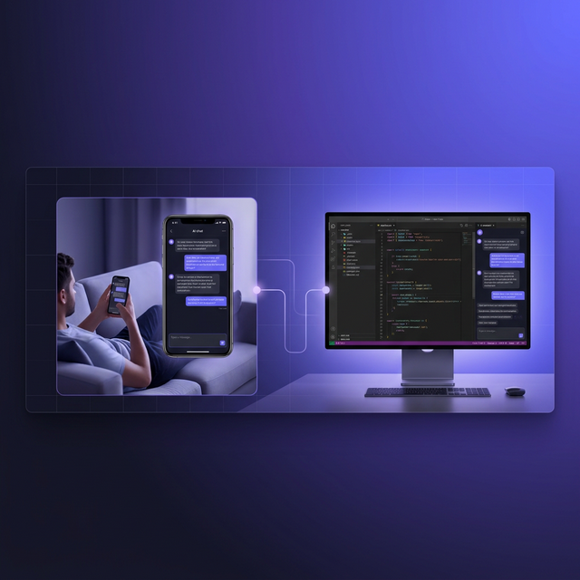

<div align="center">

# 📱 OmniAntigravity Remote Chat

### Phiên coding AI của bạn không cần kết thúc khi bạn rời khỏi bàn.

<br/>



<br/>
<br/>

   

[](https://www.npmjs.com/package/omni-antigravity-remote-chat) [](https://www.npmjs.com/package/omni-antigravity-remote-chat) [](https://hub.docker.com/r/diegosouzapw/omni-antigravity-remote-chat)

**Phản chiếu cuộc trò chuyện AI của Antigravity lên điện thoại theo thời gian thực.**
<br/>
**Gửi tin nhắn. Chuyển mô hình. Quản lý cửa sổ. Tất cả từ trình duyệt di động.**

🌐 **Available in:** 🇺🇸 [English](README.md) | 🇧🇷 [Português (Brasil)](README.pt-BR.md) | 🇪🇸 [Español](README.es.md) | 🇫🇷 [Français](README.fr.md) | 🇮🇹 [Italiano](README.it.md) | 🇷🇺 [Русский](README.ru.md) | 🇨🇳 [中文 (简体)](README.zh-CN.md) | 🇩🇪 [Deutsch](README.de.md) | 🇮🇳 [हिन्दी](README.in.md) | 🇹🇭 [ไทย](README.th.md) | 🇺🇦 [Українська](README.uk-UA.md) | 🇸🇦 [العربية](README.ar.md) | 🇯🇵 [日本語](README.ja.md) | 🇻🇳 Tiếng Việt | 🇧🇬 [Български](README.bg.md) | 🇩🇰 [Dansk](README.da.md) | 🇫🇮 [Suomi](README.fi.md) | 🇮🇱 [עברית](README.he.md) | 🇭🇺 [Magyar](README.hu.md) | 🇮🇩 [Bahasa Indonesia](README.id.md) | 🇰🇷 [한국어](README.ko.md) | 🇲🇾 [Bahasa Melayu](README.ms.md) | 🇳🇱 [Nederlands](README.nl.md) | 🇳🇴 [Norsk](README.no.md) | 🇵🇹 [Português (Portugal)](README.pt.md) | 🇷🇴 [Română](README.ro.md) | 🇵🇱 [Polski](README.pl.md) | 🇸🇰 [Slovenčina](README.sk.md) | 🇸🇪 [Svenska](README.sv.md) | 🇵🇭 [Filipino](README.phi.md)

</div>

<br/>

## 😤 

Bạn đang trong phiên coding với AI hỗ trợ. Claude đang tạo mã, Gemini đang xem xét kiến trúc. Rồi điện thoại reo, ai đó cần bạn ở bếp, hoặc bạn chỉ muốn chuyển sang sofa.

## ✅ 

OmniAntigravity phản chiếu **toàn bộ cuộc trò chuyện AI của Antigravity** lên điện thoại — theo thời gian thực, với tương tác đầy đủ.

```bash
npx omni-antigravity-remote-chat
```

---

## ⚡ Quick Start

```bash
npx omni-antigravity-remote-chat
```

```bash
npm install -g omni-antigravity-remote-chat
omni-chat
```

```bash
docker run -d --name omni-chat \
  --network host \
  -e APP_PASSWORD=your_password \
  diegosouzapw/omni-antigravity-remote-chat:latest
```

```bash
antigravity . --remote-debugging-port=7800
```

---

## 📱 How It Works

```
┌─────────────┐    CDP (7800)    ┌──────────────┐    HTTPS/WS (4747)    ┌─────────────┐
│ Antigravity  │ ◄──────────────► │  Node Server  │ ◄──────────────────► │   Phone      │
│  (Desktop)   │    DOM snapshot   │  (server.js)  │    mirror + control  │  (Browser)   │
└─────────────┘                  └──────────────┘                      └─────────────┘
```

---

## 🔑 Configuration

| Variable | Default | Description |
|---|---|---|
| `APP_PASSWORD` | `antigravity` | Authentication password |
| `PORT` | `4747` | Server port |
| `COOKIE_SECRET` | _(auto)_ | Cookie signing secret |
| `AUTH_SALT` | _(auto)_ | Auth token salt |
| `NGROK_AUTHTOKEN` | _(optional)_ | ngrok remote access |

---

## 📄 License

GPL-3.0 — [LICENSE](LICENSE)

---

<div align="center">
  <sub>Được tạo với ❤️ cho các lập trình viên code ở mọi nơi</sub>
  <br/>
  <sub><a href="https://github.com/diegosouzapw/OmniAntigravityRemoteChat">github.com/diegosouzapw/OmniAntigravityRemoteChat</a></sub>
</div>
